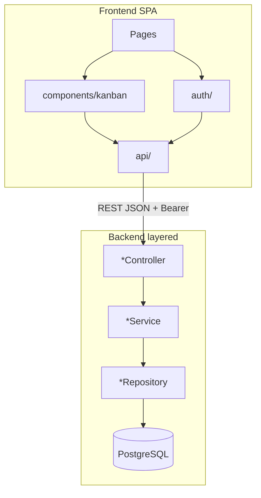
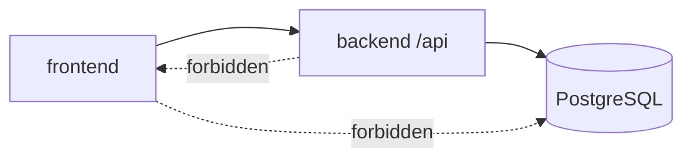
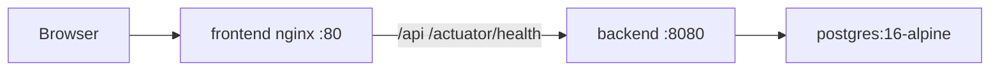
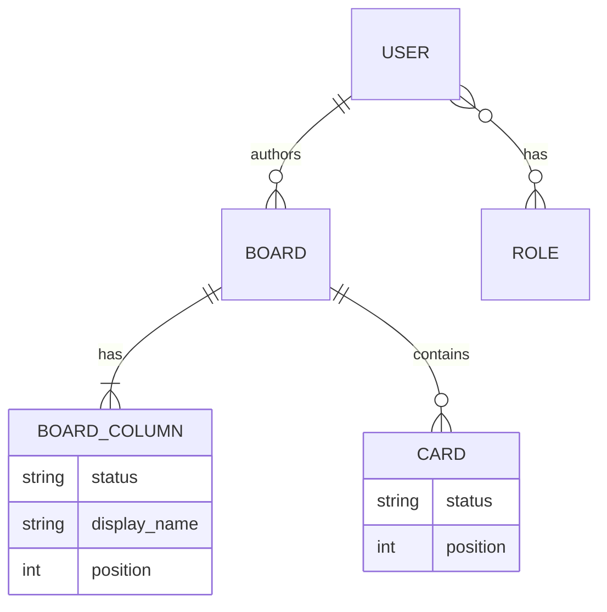

# Architecture Spine — BMAD Todo List

## Design Paradigm

**Layered REST API + component SPA.**

Backend (`com.bmad.todolist`): Controller → Service → Spring Data JPA Repository → PostgreSQL. Packages by domain: `auth`, `board`, `card`, `user`, plus `config`, `common`.

Frontend (`frontend/src`): `pages/` (routes) → `components/kanban/` (UI) → `api/` (HTTP) → backend `/api`. Auth session lives in `auth/` (`AuthContext`, `ProtectedRoute`).



## Invariants & Rules

### AD-1 — Layering and package shape `[ADOPTED]`

- **Binds:** all backend and frontend modules
- **Prevents:** business rules in controllers/UI; god-packages; parallel architecture styles
- **Rule:** Backend keeps Controller → Service → Repository. Frontend keeps pages / components / api / auth. New Kanban behavior lands in `board` or `card` (BE) and `components/kanban` + `api/kanban.ts` (FE), subject to AD-11 aggregate boundaries.

### AD-2 — Dependency direction `[ADOPTED]`

- **Binds:** FE↔BE boundary; backend packages
- **Prevents:** FE calling JDBC/DB; BE depending on FE; controller-to-controller coupling; second HTTP stack
- **Rule:** Only FE → BE over `/api` (JSON). Backend does not import frontend. Controllers call Services only. Domain Services may use peer Repositories within their aggregate (AD-11); they do not call other Controllers.



### AD-3 — Authn/Authz and session storage `[ADOPTED]`

- **Binds:** FR-1–FR-4, FR-5–FR-14 access, security NFR
- **Prevents:** localStorage/cookie/URL tokens; `hasAuthority('ADMIN')` vs `hasRole('ADMIN')` drift; session cookies; CSRF filter reintroduction without a task; unprotected Kanban routes
- **Rule:** Stateless JWT in `Authorization: Bearer`. Security filter chain: CSRF disabled, `SessionCreationPolicy.STATELESS`, CORS as in AD-10. Client stores token only in `sessionStorage` key `todolist.accessToken`. On SPA bootstrap, invalid/expired token is cleared and the user is sent to login. Public: `POST /api/auth/login`, `GET /actuator/health`. Remaining `/api/**` authenticated. All Kanban endpoints use `@PreAuthorize("hasRole('ADMIN')")`. Logout is client-only (clear `sessionStorage`); no server revoke. Default TTL 1h via `JWT_EXPIRATION_MS`. Do not change CSRF/session policy without an explicit task.

### AD-4 — Three-column status invariant `[ADOPTED]`

- **Binds:** FR-6, FR-9, FR-10; SM-1, SM-C1
- **Prevents:** custom/add/remove/replace statuses; sorting lanes by enum ordinal instead of column position; divergent FE/BE status enums
- **Rule:** Every Board has exactly three Columns whose **identity** is `ColumnStatus` (the enum’s three values). Column **`position` (0..2)** is display order only — UI and `GET` board render columns ordered by `position`, not by enum declaration order. Only display name and `position` may change, via atomic full-set save; status on a column id cannot change. FE and BE share the same `ColumnStatus` literals; JSON display field is `name` (JPA `displayName`).

### AD-5 — Ownership and write locking `[ADOPTED]`

- **Binds:** FR-5–FR-14; SM-3
- **Prevents:** cross-author data exposure; concurrent position corruption
- **Rule:** Boards belong to `author_id`. Reads/mutations use author-scoped queries (`findByIdAndAuthorId` / `findOwned*`). Mutations that reorder take `findOwned*ForUpdate` (pessimistic) on the Board. Foreign or missing board/card IDs return **404**, not 403.

### AD-6 — Card position and status mutation authority `[ADOPTED]`

- **Binds:** FR-11–FR-14; SM-2
- **Prevents:** two writers of `Card.position`/`Card.status`; dual FE sync policies treated as optional
- **Rule:** Only `CardService` mutates Card rows (`title`, `description`, `status`, `position`). Server normalizes `position` after create/move/delete. Move payload is `targetStatus` + `targetIndex` (0..size after removing the moving card). `BoardService.configureColumns` must not write Card rows. Card drag-and-drop uses `@dnd-kit` with mouse, touch, and keyboard via the drag-handle. FE: create/update/delete card and board/column saves apply the successful API payload (or reload board) into local state; **move** uses optimistic local order with rollback on error and does **not** re-apply the move response. After full board reload, UI shows server order. `[ASSUMPTION: move stays optimistic until an explicit sync story; PRD as-is overrides project-context “always sync from move response”.]`

### AD-7 — Schema ownership `[ADOPTED]`

- **Binds:** all persistence
- **Prevents:** Hibernate auto-mutation of schema; rewritten history
- **Rule:** Schema changes only via a new Flyway file `V<next>__<name>.sql` (never edit applied V1/V2). `spring.jpa.hibernate.ddl-auto=validate`. Runtime DB PostgreSQL; tests use H2 `MODE=PostgreSQL` profile `test`. Deleting a Board cascades to its Columns and Cards via FK `ON DELETE CASCADE` — do not reimplement orphan cleanup in application code unless replacing that constraint.

### AD-8 — Error and DTO contract shape `[ADOPTED]`

- **Binds:** all `/api` responses; FE `ApiError`
- **Prevents:** ad-hoc error JSON; duplicated DTO type definitions; status synonym drift
- **Rule:** Errors use `{ "message": string, "details": string[] }` via `ApiExceptionHandler`. HTTP codes: 400/401/403/404/409 as today. Backend DTOs are nested records in `*Dtos` with Bean Validation. `CardResponse` is defined only in `CardDtos`; any mapper (including board read assembly) must emit the same fields. FE contract types live beside functions in `frontend/src/api/*`. Field maxima: board name 120, column name 80, card title 200, description 4000.

### AD-9 — Frontend HTTP single path `[ADOPTED]`

- **Binds:** all FE network I/O to the product API
- **Prevents:** scattered `fetch`; axios/React Query without an explicit task
- **Rule:** Every call to `/api/**` goes through `apiRequest` in `frontend/src/api/client.ts`. Pages and components do not call `fetch('/api...')` directly. Board state stays local React state (no global store). Health may be hit via proxy outside this rule for ops probes.

### AD-10 — Deploy, CORS, and environment envelope `[ADOPTED]`

- **Binds:** FR-15; ops; local vs compose ports
- **Prevents:** alternate topologies that break proxy or secrets; exposing non-health actuators; silent CORS tightening/loosening mid-feature
- **Rule:** Canonical stack is Docker Compose: `postgres:16-alpine` → backend → frontend (nginx). Secrets and admin bootstrap from env (`JWT_SECRET`, `JWT_*`, `ADMIN_*`, `DATABASE_*`). Actuator exposes **health only**. Local Vite proxies `/api` and `/actuator` to `localhost:8081`; Compose backend listens on `8080`. Do not “unify” ports by breaking either path. CORS remains `allowedOriginPatterns: *` with `allowCredentials: false` until an explicit security task changes it.



### AD-11 — Aggregate boundaries `[ADOPTED]`

- **Binds:** board/card packages; FR-5–FR-14
- **Prevents:** two owners of Card writes; BoardService vs CardService fighting over the same rows
- **Rule:** **Board** is the Kanban aggregate root for ownership and locking. **CardService** is the exclusive writer of Card entities. **BoardService** owns Board and BoardColumn writes and assembles the Board read model (may read `CardRepository`). Do not introduce a second Card write path from BoardService or Controllers.

### AD-12 — Board read-model composition `[ADOPTED]`

- **Binds:** FR-5, FR-9–FR-14 UI load
- **Prevents:** nested vs flat board payloads shipping side by side
- **Rule:** Canonical board detail is nested: `BoardResponse.columns[]` each with `cards[]` (`ColumnResponse`). List endpoint returns summaries without cards. Do not add a parallel “flat cards list for the same screen” as the default board load without replacing this AD. FE `Board` type mirrors that tree in `api/kanban.ts`.

## Consistency Conventions

| Concern | Convention |
| --- | --- |
| Naming (BE) | `*Controller` / `*Service` / `*Repository` / `*Dtos` / `*IntegrationTest`; domain packages under `com.bmad.todolist` |
| Naming (FE) | PascalCase components; `*Page.tsx`; api modules `auth.ts` / `kanban.ts`; named exports (except existing `App` default) |
| Java style | tabs; `jakarta.*` only; no Lombok on entities/DTOs |
| IDs & time | Numeric DB ids; `Instant` + UTC on server; no Open Session in View (`open-in-view: false`) |
| Errors | Russian fallback strings in FE `client.ts`; server `message`/`details` envelope |
| Auth principal | `@AuthenticationPrincipal UserPrincipal` in controllers; do not parse JWT in controllers |
| Board name uniqueness | Unique per author, case-insensitive check + DB unique `(author_id, name)` |
| Trim | Titles/names trimmed server-side; empty after trim → 400 |
| Passwords | BCrypt; never log or return hashes |
| UI copy | Russian, matching existing screens |
| Tests (BE) | Touching `/api/**` extends MockMvc IT (`AuthIntegrationTest` / `KanbanIntegrationTest` or new `*IntegrationTest`); auth via real login + Bearer |
| Tests (FE) | Gate = `npm run lint` + `npm run build`; no Jest/Vitest/Playwright without a task |
| Card DnD | `@dnd-kit` only (pointer + keyboard via drag-handle); no alternate HTML5 DnD library |
| Config | Never commit `.env`; template is `.env.example` |

## Stack

| Name | Version |
| --- | --- |
| Java | 17 |
| Spring Boot | 4.0.7 |
| JJWT | 0.12.6 |
| Spring Data JPA + Flyway | (Boot-managed) |
| PostgreSQL (Compose) | 16-alpine |
| H2 (test) | (Boot-managed) |
| React | 18.3 |
| TypeScript | ~5.6 |
| Vite | 5.4 |
| react-router-dom | 6.30 |
| @dnd-kit/core | ^6.3 |
| @dnd-kit/sortable | ^10.0 |
| @dnd-kit/utilities | ^3.2 |
| Node (build) | 20+ |
| nginx (FE prod) | 1.27 |

## Structural Seed

```text
bmad-todolist/
  backend/src/main/java/com/bmad/todolist/
    auth/ board/ card/ user/ config/ common/
  backend/src/main/resources/db/migration/   # Flyway only
  frontend/src/
    api/ auth/ pages/ components/kanban/
  docker-compose.yml                         # db + backend + frontend
```



## Capability → Architecture Map

| Capability / Area | Lives in | Governed by |
| --- | --- | --- |
| Auth login / me / logout / bootstrap (FR-1–4) | `auth/`, `config/AdminBootstrap`, `frontend/src/auth` | AD-3, AD-1 |
| Boards list/create/rename/delete (FR-5–8) | `board/`, `pages/BoardsPage` | AD-4, AD-5, AD-7, AD-8, AD-11, AD-12 |
| Columns invariant + configure (FR-9–10) | `BoardService`, `ColumnSettings` | AD-4, AD-5, AD-11 |
| Cards CRUD + move (FR-11–14) | `card/`, `components/kanban` | AD-5, AD-6, AD-8, AD-9, AD-11, AD-12 |
| Health (FR-15) | Actuator + nginx/Vite proxy | AD-10 |
| Error UX / ApiError | `common/`, `api/client.ts` | AD-8, AD-9 |

## Deferred

- CI/CD workflows — not present; add only under an explicit ops task.
- Narrowing CORS from `*` — current `*` is **frozen by AD-10** until a dedicated security task; not a silent epic choice.
- Server-side token revoke / mid-session global 401 handler — not in as-is product.
- Unifying BoardService/CardService CardResponse mapping into one shared function — type is single (`CardDtos`); extract helper only when touching both mappers.
- Syncing FE board state from successful **move** response — desired in `project-context.md`, not current code; change only with an explicit story.
- Multi-user roles, custom statuses, export/backup, rich card fields — Non-Goals; out of this spine.
- Provider/cloud topology beyond Compose — self-hosted Compose is the envelope; no cloud binding.
- Product UX owned by PRD (not spine divergence points): auto-select first board after list load; `window.confirm` before board/card delete; purge invalid JWT on SPA bootstrap — implementers follow PRD FR text.
