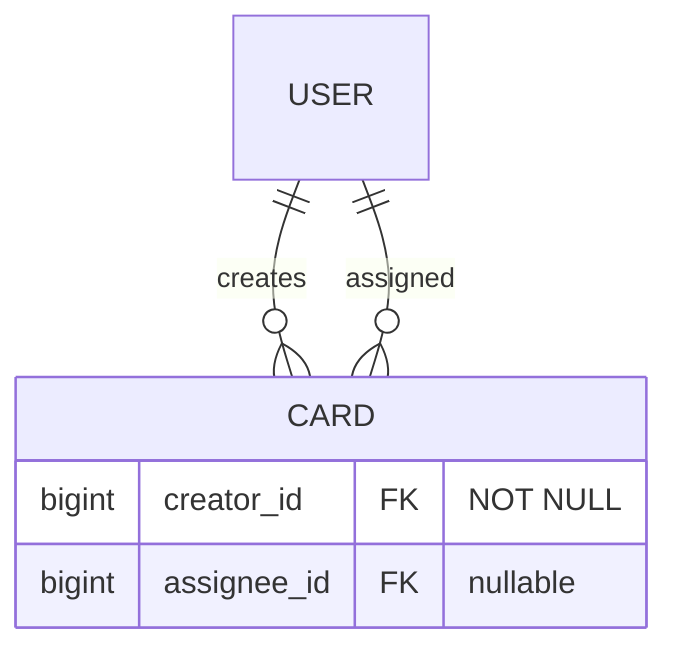

# Architecture Delta: Назначение исполнителя (assignee) и создателя (creator) на карточку

---

## 1. Sources and Scope

### 1.1 Sources

| Источник | Статус | Роль в дельте |
|----------|--------|---------------|
| `_bmad-output/planning-artifacts/prds/prd-bmad-todolist-2026-07-18/prd.md` | final | AS-IS требования; Non-Goals §5 отменяются в части «назначения исполнителей» |
| `_bmad-output/planning-artifacts/prds/prd-bmad-todolist-2026-07-18/addendum.md` | draft | Основной источник требований дельты: BP, AC, EC, OQ |
| Product Impact Assessment | — | Матрица затронутых компонентов, регрессионные гипотезы, NFR concerns |
| Analysis & Recommendations | — | Бизнес-правила, приёмочные критерии, edge cases, открытые вопросы |
| PRD Validation Summary | CONCERNS | 3 high findings: Success Metrics, UJ формализация, открытые BP. Приняты к сведению |
| `_bmad-output/planning-artifacts/architecture/architecture-bmad-todolist-2026-07-18/ARCHITECTURE-SPINE.md` | final | Parent spine — binding read-only Inherited Invariants (AD-1..AD-12) |
| `_bmad-output/project-context.md` | complete | Persistent facts: стек, инварианты, coding rules |

### 1.2 Scope

**Входит в дельту:**
- Модель `Card`: поля `creator` (NOT NULL), `assignee` (nullable) — ManyToOne → User
- `CardService`: логика установки creator/assignee + предоставление доступа к board
- `BoardService`: расширение проверки доступа (author_id OR EXISTS assignee)
- Новый endpoint `GET /api/users` (только ADMIN) — список пользователей для UI
- Flyway V3: миграция cards + бэкфилл существующих записей
- FE: Avatar-компонент, поле assignee в CardForm, отображение creator/assignee в Card, адаптация BoardPage для роли исполнителя
- FE: новый модуль `api/user.ts` с `getUsers()`

**Что НЕ входит в дельту (explicit non-goals):**
- `POST /api/users` — создание пользователей (precondition, out of scope; требуется отдельная задача)
- Уведомления о назначении (in-app / email / push)
- Self-signup / регистрация / восстановление пароля
- Отдельная таблица `board_members` — доступ через EXISTS
- Кастомные статусы, вложения, комментарии, метки, сроки
- Публичный API, вебхуки, интеграции
- Граватар / загрузка фото аватаров
- Мобильные приложения, экспорт/импорт
- Кэширование прав доступа

### 1.3 Validation Findings (CONCERNS)

| Finding | Статус в дельте |
|---------|-----------------|
| Нет Success Metrics для multi-user коллаборации | **Принято.** Добавление SMs — ответственность PO; архитектура дельты не блокируется |
| UJ-N1..N3 не формализованы как User Journeys | **Принято.** Architectural assumptions покрывают сценарии; формальные UJ — задача UX/story creation |
| BP-4, BP-5, BP-11 — открытые вопросы | **Закрыты в дельте** (см. раздел 4 — Architecture Delta) |

### 1.4 Parent Spine Refs

Следующие AD из parent spine затрагиваются дельтой:

| AD | Характер изменения |
|----|-------------------|
| AD-3 (Authn/Authz) | Расширение: `@PreAuthorize("hasRole('ADMIN')")` сохраняется для мутаций; для GET-запросов — новая логика (ADMIN OR assignee) без PreAuthorize |
| AD-5 (Ownership) | Расширение: доступ к board теперь не только по `author_id`, но и по `assignee_id` |
| AD-6 (Card position/status) | Без изменений — move не затрагивает assignee |
| AD-11 (Aggregate boundaries) | Подтверждение: CardService — единственный writer Card, включая assignee |

---

## 2. Inherited Invariants

Parent spine AD-1..AD-12 являются binding read-only. Ниже — только те, которые directly bind данную дельту, с указанием constraints:

| Inherited | From parent AD | Binds here |
|-----------|---------------|------------|
| Layering: Controller → Service → Repository | AD-1 | Новый `UserController` → `UserService` → `UserRepository` |
| FE → BE over `/api` (JSON); BE не зависит от FE | AD-2 | `GET /api/users`, обновлённые DTO карточек |
| Stateless JWT; `@PreAuthorize("hasRole('ADMIN')")` на мутациях | AD-3 | Мутации карточек и board остаются ADMIN-only; GET /api/users — ADMIN-only |
| 3 колонки; ColumnStatus enum; position 0..2 | AD-4 | Без изменений |
| Board ownership + `findOwned*ForUpdate`; чужие id → 404 | AD-5 | Расширяется: доступ author OR assignee; чужие id → 404 (для не-авторов и не-исполнителей) |
| Только CardService мутирует Card; move не меняет статус поля assignee | AD-6 | Подтверждено: move не включает assigneeId |
| Schema → Flyway V<next>.sql; ddl-auto=validate | AD-7 | V3 миграция |
| Error envelope `message` + `details`; DTO nested records | AD-8 | Новый UserDto, обновлённый CardDtos |
| FE HTTP только через `apiRequest` | AD-9 | `getUsers()` через `apiRequest` |
| deploy/CORS/envelope | AD-10 | Без изменений |
| Board — aggregate root; CardService — exclusive writer Card | AD-11 | Подтверждено: assignee устанавливается через CardService, не BoardService |
| Board read-model nested (columns[].cards[]) | AD-12 | Без изменений; CardResponse расширяется полями creator/assignee |

---

## 3. Technical Impact Map

### 3.1 Affected Services / Modules

| Модуль | Характер | Изменение |
|--------|----------|-----------|
| `card/Card.java` | Прямое | Поля `creator` (ManyToOne User, NOT NULL), `assignee` (ManyToOne User, nullable); LAZY + `@NamedEntityGraph` |
| `card/CardDtos.java` | Прямое | `CardResponse` → `creatorId`, `creatorUsername`, `assigneeId`, `assigneeUsername`. `CreateCardRequest`/`UpdateCardRequest` → `assigneeId` (nullable Long) |
| `card/CardService.java` | Прямое | `create`: установить creator из UserPrincipal, опционально assignee + выдача доступа. `update`: опционально обновить assignee + синхронизация доступа |
| `card/CardRepository.java` | Прямое | `existsByBoardIdAndAssigneeId()` — для проверки доступа; `findByBoardIdWithCreatorAndAssignee()` — @EntityGraph |
| `board/BoardService.java` | Прямое | `canAccessBoard(userId, boardId)`: `author_id = ? OR EXISTS(SELECT 1 FROM cards WHERE board_id = ? AND assignee_id = ?)`. Переиспользовать в `getBoardsForUser()` |
| `board/BoardRepository.java` | Прямое | `@Query` для EXISTS-подзапроса; `findByAuthorIdOrAssigneeId()` для списка досок |
| `user/UserService.java` (новый) | Новый | Метод `getAllUsers()` — только id + username |
| `user/UserController.java` (новый) | Новый | `GET /api/users` — @PreAuthorize("hasRole('ADMIN')") |
| `user/UserRepository.java` | Косвенное | `findAllByOrderByUsername()` — без паролей |
| Flyway `V3__add_card_users.sql` | Прямое | Миграция схемы + бэкфилл |

| FE Модуль | Характер | Изменение |
|-----------|----------|-----------|
| `api/kanban.ts` | Прямое | Типы Card, CreateCardRequest, UpdateCardRequest — поля creator/assignee |
| `api/user.ts` (новый) | Новый | `getUsers(): Promise<UserDto[]>` через apiRequest |
| `components/kanban/Card.tsx` | Прямое | Отображение creator username + Avatar assignee (или placeholder) |
| `components/kanban/CardForm.tsx` | Прямое | Dropdown assignee (загрузка из getUsers), creator read-only |
| `components/kanban/Avatar.tsx` (новый) | Новый | Круг с инициалами, размеры small/medium; серый фон + первая буква username |
| `components/kanban/BoardPage.tsx` | Прямое | Условный рендеринг: ADMIN видит мутации, assignee — только просмотр |

### 3.2 API / Contracts

| Endpoint | Изменение |
|----------|-----------|
| `POST /api/cards` | `CreateCardRequest.assigneeId` (nullable Long) → при наличии устанавливает assignee + выдаёт доступ |
| `PUT /api/cards/{id}` | `UpdateCardRequest.assigneeId` (nullable Long) — смена/null assignee; синхронизация доступа |
| `GET /api/boards/{id}` | Проверка доступа: author_id OR EXISTS assignee_id. Для assignee — те же поля BoardResponse |
| `GET /api/boards` | `findByAuthorIdOrAssigneeId()` — доски, где пользователь автор ИЛИ исполнитель |
| `GET /api/users` (новый) | `@PreAuthorize("hasRole('ADMIN')")` → `[{id, username}]`; без пагинации; query param `?q=` заложен но не обязателен для MVP |

### 3.3 Data / DB / Ownership

| Объект | Изменение |
|--------|-----------|
| `cards` | `creator_id BIGINT NOT NULL REFERENCES users(id)`; `assignee_id BIGINT REFERENCES users(id)`; индексы на creator_id, assignee_id |
| `cards.creator_id` | NOT NULL — каждая карточка всегда имеет создателя |
| `cards.assignee_id` | NULLABLE — исполнитель опционален |
| Ownership доступа | Расширение: `author_id OR EXISTS assignee_id` — доступ к board теперь не только по владению |

### 3.4 Events / Queues

Без изменений — событийная модель не вводится.

### 3.5 Integrations

Без изменений — новых внешних интеграций нет.

### 3.6 Regression Areas

| # | Область | Риск | Mitigation |
|---|---------|------|------------|
| RGR-1 | GET /api/boards — утечка досок | Некорректный EXISTS-подзапрос | EXISTS с параметром userId и boardId |
| RGR-2 | GET /api/boards/{id} — чужая доска | Ложное срабатывание EXISTS | EXISTS проверяет только assignee_id = current user |
| RGR-3 | Мутации карточек — доступ assignee | Исполнитель получит доступ к мутации | @PreAuthorize("hasRole('ADMIN')") сохраняется |
| RGR-4 | Integration tests — NOT NULL creator | Старые тесты без creator | Fixture — указать creator для всех карточек |
| RGR-5 | Миграция V3 — NOT NULL на существующие | Без бэкфилла — ошибка | UPDATE WHERE creator_id IS NULL → id bootstrap-админа |
| RGR-6 | UI — null assignee | Ошибка рендеринга | FE проверяет assignee на null |
| RGR-7 | FE optimistic move + assignee | Локальный state не синхронизирован | Move не меняет assignee — без изменений |
| RGR-8 | DELETE board каскад | Каскадное удаление FK | FK ON DELETE CASCADE — корректно каскадирует |

---

## 4. Proposed Architecture Delta

### 4.1 Card Entity — creator и assignee



**Изменение:** `Card.java` получает:
- `@ManyToOne(fetch = LAZY) @JoinColumn(name = "creator_id", nullable = false) private User creator;`
- `@ManyToOne(fetch = LAZY) @JoinColumn(name = "assignee_id") private User assignee;`
- `@NamedEntityGraph(name = "Card.withCreatorAndAssignee", attributeNodes = {@NamedAttributeNode("creator"), @NamedAttributeNode("assignee")})`

**Загрузка:** `CardRepository` использует `@EntityGraph("Card.withCreatorAndAssignee")` в методах чтения, для мутаций — `@Transactional` гарантирует загрузку внутри сессии.

### 4.2 Доступ к Board — расширение AD-5

```sql
-- Новая логика: пользователь имеет доступ к board если:
-- 1. Он автор (author_id = :userId), ИЛИ
-- 2. Существует карточка на этой board с assignee_id = :userId
SELECT b FROM Board b 
WHERE b.id = :boardId 
  AND (b.author.id = :userId 
       OR EXISTS(SELECT 1 FROM Card c WHERE c.board.id = :boardId AND c.assignee.id = :userId))
```

**Изменение в `BoardService`:**
- `getBoardForUser(boardId, userId)` — новая проверка доступа
- `getBoardsForUser(userId)` — `findByAuthorIdOrAssigneeId()`
- `@PreAuthorize("hasRole('ADMIN')")` остаётся на всех мутациях (create/update/delete board, configure columns)

**Изменение в `CardService`:**
- При установке `assignee` — доступ к board выдаётся атомарно (в той же транзакции)
- При снятии `assignee` — доступ сохраняется, если пользователь остаётся assignee на других карточках той же board; теряется, если это была последняя карточка (EXISTS на каждый запрос)

### 4.3 User endpoint — GET /api/users

```text
GET /api/users
Authorization: Bearer <ADMIN JWT>
Response 200: [{ "id": 1, "username": "admin" }, { "id": 2, "username": "worker" }]
```

- `@PreAuthorize("hasRole('ADMIN')")` — только ADMIN
- Возвращает только `id` + `username` (без пароля, email, ролей)
- Без пагинации для MVP; query param `?q=` заложен в интерфейсе сервиса
- UserDto — record в `user/UserDtos.java`

### 4.4 FE — Адаптация BoardPage для ролей

```typescript
// Определение роли на основе JWT
const { user } = useAuth();
const isAdmin = user?.roles?.includes('ADMIN') ?? false;
```

- `isAdmin = true` — полный UI (создание, редактирование, удаление, настройка колонок)
- `isAdmin = false` — read-only UI (только просмотр досок и карточек)

Avatar-компонент:
```typescript
// Avatar.tsx — круг с инициалами (первые 1-2 буквы username)
// Размеры: small (24px), medium (32px)
// Цвет фона: серый (#CBD5E1) для MVP
```

### 4.5 Schema Migration — Flyway V3

```sql
-- V3__add_card_users.sql
ALTER TABLE cards ADD COLUMN creator_id BIGINT;
ALTER TABLE cards ADD COLUMN assignee_id BIGINT;

-- Бэкфилл существующих записей: creator = bootstrap admin
UPDATE cards SET creator_id = (SELECT u.id FROM users u 
  JOIN user_roles ur ON ur.user_id = u.id 
  JOIN roles r ON r.id = ur.role_id 
  WHERE r.name = 'ROLE_ADMIN' LIMIT 1)
WHERE creator_id IS NULL;

ALTER TABLE cards ALTER COLUMN creator_id SET NOT NULL;
ALTER TABLE cards ADD CONSTRAINT fk_card_creator FOREIGN KEY (creator_id) REFERENCES users(id);
ALTER TABLE cards ADD CONSTRAINT fk_card_assignee FOREIGN KEY (assignee_id) REFERENCES users(id);
CREATE INDEX idx_cards_creator_id ON cards(creator_id);
CREATE INDEX idx_cards_assignee_id ON cards(assignee_id);
```

### 4.6 DTO Changes

```java
// CardDtos.java — изменения
public record CardResponse(
  // ... существующие поля
  Long creatorId,
  String creatorUsername,
  Long assigneeId,       // nullable
  String assigneeUsername // nullable
) {}

public record CreateCardRequest(
  @NotBlank @Size(max = 200) String title,
  @Size(max = 4000) String description,
  @NotNull CardStatus status,
  Long assigneeId  // nullable, null = без исполнителя
) {}

public record UpdateCardRequest(
  @NotBlank @Size(max = 200) String title,
  @Size(max = 4000) String description,
  Long assigneeId  // nullable, null = снять назначение
) {}
```

### 4.7 FE Type Changes

```typescript
// api/kanban.ts
export interface Card {
  // ... существующие поля
  creatorId: number;
  creatorUsername: string;
  assigneeId: number | null;
  assigneeUsername: string | null;
}

export interface CreateCardRequest {
  title: string;
  description?: string;
  status: ColumnStatus;
  assigneeId?: number | null;
}

export interface UpdateCardRequest {
  title: string;
  description?: string;
  assigneeId?: number | null;
}
```

### 4.8 Закрытые Open Questions

| OQ / Вопрос | Решение | Обоснование |
|-------------|---------|-------------|
| OQ-1 (BP-4): доступ ко всей Доске? | **Да, вся Доска целиком** | Соответствует AC-6.2; упрощает реализацию; будущая ролевая модель может уточнить |
| OQ-2 (BP-5): что при снятии последнего assignee? | **Доступ теряется немедленно** | EXISTS на каждый запрос; без кэширования прав; согласуется с C-6 |
| OQ-3 (BP-11): как выбирать assignee в UI? | **Выпадающий список всех пользователей** | GET /api/users; query param `?q=` заложен для будущего |
| OQ-4: стратегия удаления пользователя? | **SET NULL для assignee_id; запрет для creator** | creator всегда реальный пользователь |
| OQ-5: создание пользователей? | **Out of scope — precondition** | Требуется отдельная задача (POST /api/users или SQL) |
| OQ-6: поля GET /api/users? | **id + username** | Без пароля, email, роли |
| OQ-7: пагинация GET /api/users? | **Без пагинации для MVP** | 2-10 пользователей в типичном сценарии |
| OQ-8: FE ADMIN vs assignee? | **JWT roles** | `user.roles.includes('ADMIN')` |
| OQ-9: FetchType creator/assignee? | **LAZY + @EntityGraph** | open-in-view: false — загрузка внутри @Transactional |
| OQ-10: move + assignee? | **Не затрагивает** | Payload move не включает assigneeId |

---

## 5. Downstream Constraints

### 5.1 Implementation Requirements

| # | Требование | Обоснование |
|---|-----------|-------------|
| IR-1 | creator_id заполняется автоматически из @AuthenticationPrincipal | Безопасность; пользователь не может подменить creator |
| IR-2 | assignee_id проверяется на существование (404 если не найден) | AC-1.3 |
| IR-3 | Назначение assignee + выдача доступа — в одной @Transactional | Атомарность (NFR-4) |
| IR-4 | Снятие assignee — проверка EXISTS на другие карточки той же board | Если остались назначения — доступ сохраняется (EC-2) |
| IR-5 | Существующие IntegrationTest — creator_id в fixture | RGR-4; без creator — SQL Error |
| IR-6 | CardResponse.creatorUsername/assigneeUsername загружаются через JOIN, не через отдельный query | Производительность; EntityGraph |
| IR-7 | FE Avatar — инициалы из username; серый фон; placeholder при null assignee | C-8, AC-5.2 |
| IR-8 | FE скрытие мутаций для assignee: кнопки create/edit/delete, column settings, board management | AC-6.3, AC-6.4 |
| IR-9 | GET /api/users не возвращает пароли/email/роли | Безопасность; анализ recommendation |
| IR-10 | move-операция не включает assigneeId — assignee не меняется при перемещении | Подтверждение OQ-10 |
| IR-11 | Повторное назначение того же assignee — идемпотентно (BP-10) | EC-8; UPSERT или проверка перед вставкой |

### 5.2 Dependencies / Order

| Порядок | Зависимость | Блокирует |
|---------|-----------|-----------|
| 1 | Flyway V3 (миграция БД) | Backend-изменения |
| 2 | Backend: Card entity + repository | CardService |
| 3 | Backend: UserController/UserService | FE getUsers() |
| 4 | Backend: CardService + BoardService access | FE BoardPage |
| 5 | FE: api/kanban.ts типы | FE Card/CardForm/BoardPage |
| 6 | FE: Avatar компонент | FE Card |
| 7 | FE: BoardPage адаптация роли | Завершение FE |

**Blocker:** precondition OQ-5 (существование минимум 2 пользователей). Без механизма создания пользователей фича не тестируема.

### 5.3 Contract / Migration Tests

| # | Тест | Тип |
|---|------|-----|
| CT-1 | POST /api/cards без assigneeId — creator = current user, assignee = null | Backend IT |
| CT-2 | POST /api/cards с assigneeId — creator + assignee + assignee получает доступ | Backend IT |
| CT-3 | POST /api/cards с несуществующим assigneeId — 404 | Backend IT |
| CT-4 | PUT /api/cards/{id} с assigneeId: null — снятие назначения | Backend IT |
| CT-5 | PUT /api/cards/{id} с новым assigneeId — смена + доступ новому | Backend IT |
| CT-6 | GET /api/boards — assignee видит доски где есть его карточки | Backend IT |
| CT-7 | GET /api/boards/{id} — assigne 200, чужой 404 | Backend IT |
| CT-8 | GET /api/users — ADMIN 200, assignee 403 | Backend IT |
| CT-9 | Move card — assignee не меняется | Backend IT |
| CT-10 | Существующие тесты не сломаны (regression) | Backend IT / CI |

### 5.4 NFR / Security

| NFR | Требование | Реализация |
|-----|-----------|------------|
| NFR-1 | Приватность данных | Исполнитель видит все карточки Доски — решение PO (OQ-1) |
| NFR-2 | Производительность EXISTS | Без кэширования для MVP; при >1000 карточек на board — добавить кэш (deferred) |
| NFR-3 | Назначение без согласия | Принятый риск R-3; без защиты в MVP |
| NFR-4 | Атомарность | @Transactional + pessimistic lock на board (AD-5) |
| NFR-5 | Идемпотентность | EXISTS-проверка перед установкой assignee |
| NFR-6 | Миграция данных | Бэкфилл creator_id = bootstrap admin; SET NOT NULL после |

---

## 6. Delivery Mechanics

### 6.1 Feature Flags

Feature flag не требуется — изменение самодостаточно (additive). Новые поля `assignee_id`/`creator_id` nullable для обратной совместимости (кроме creator_id — бэкфилл).

### 6.2 Migration / Backfill / Compatibility

**Backward compatibility:**
- Существующие карточки получают `creator_id = bootstrap admin` (единственный пользователь до фичи)
- `assignee_id` = NULL для всех существующих карточек (нет назначений)
- Старый FE без полей creator/assignee продолжает работать (поля игнорируются)

**Flyway V3:**
- ALTER TABLE с nullable → бэкфилл → SET NOT NULL для creator_id
- Индексы после бэкфилла
- Тестовые данные (H2) — обновить `test/resources/data.sql` или fixture

### 6.3 Rollout

1. Flyway V3 — автоматически при старте backend
2. Backend deploy — новые endpoint + изменённые сервисы
3. Frontend deploy — обновлённые компоненты

**Порядок деплоя:** backend first, затем frontend (обратная совместимость API).

### 6.4 Rollback

- **Backend:** откатить V3 → V2 (drop columns creator_id, assignee_id) + откат backend кода
- **Frontend:** откат до предыдущей версии
- **Данные:** creator_id — безвозвратная потеря при откате (данные сохраняются в БД при V3, но не используются старым кодом)

### 6.5 Observability / Alerting

- Health check — без изменений
- Логирование: `CardService.create()` и `CardService.update()` логируют установку assignee
- Метрики: не добавляются для MVP (можно добавить counter назначений при необходимости)

---

## 7. Risks / Assumptions / Open Questions

### 7.1 Risks

| ID | Риск | Вероятность | Impact | Mitigation |
|----|------|------------|--------|------------|
| R-1 | Утечка контекста Доски при ошибочном назначении | Low | Medium | UI предупреждение при назначении нового пользователя (deferred) |
| R-2 | Нарушение приватности — assignee видит все карточки | Medium | Medium | Принятое архитектурное решение (OQ-1) |
| R-3 | Назначение без согласия | Low | Low | Принятый риск; MVP без защиты |
| R-4 | Потеря доступа mid-session при снятии assignee | Low | Low | Естественное поведение EXISTS |
| R-5 | Поломка существующих IT при миграции | Medium | High | Закладывается в план реализации |

### 7.2 Assumptions

| ID | Допущение |
|----|-----------|
| A-1 | Минимум 2 пользователя существует на момент использования фичи (precondition) |
| A-2 | Assignee использует ту же JWT-аутентификацию, тот же login-page, sessionStorage; не требуется новый auth endpoint |
| A-3 | Bootstrap admin существует в БД с ролью ROLE_ADMIN |
| A-4 | Имена пользователей уникальны (существующий инвариант из AdminBootstrap) |
| A-5 | Move-операция никогда не будет менять assignee в рамках данной фичи |
| A-6 | При удалении Доски FK CASCADE корректно обрабатывает assignee_id (карточки удаляются, FK не блокирует) |
| A-7 | GET /api/users при 0 результатах (никто кроме ADMIN) возвращает пустой массив `[]` |

### 7.3 Open Questions

| OQ | Вопрос | Статус | Рекомендация |
|----|--------|--------|-------------|
| OQ-5 | Механизм создания дополнительных пользователей | **BLOCKER** | Реализовать `POST /api/users` (только ADMIN) или предоставить SQL-скрипт до реализации фичи |
| OQ-7 (остаток) | Нужна ли пагинация GET /api/users при росте >20 пользователей? | Deferred | Добавить при появлении требования; архитектура закладывает query param `?q=` |
| PO-Q1 | Success Metrics для multi-user коллаборации | Deferred | Добавить в addendum перед реализацией (validation finding) |
| PO-Q2 | Формализация UJ-N1..N3 | Deferred | Добавить в addendum перед story creation (validation finding) |

---

## 8. Spine ADR Updates

После approve данной дельты, следующие решения должны быть добавлены в `ARCHITECTURE-SPINE.md`:

| Изменение | Тип | Описание |
|-----------|-----|----------|
| AD-3 (amend) | Amend | Расширить: для GET /api/boards и GET /api/boards/{id} — доступ ADMIN OR assignee (без PreAuthorize); мутации остаются ADMIN-only |
| AD-5 (amend) | Amend | Расширить: доступ к Board — `author_id` OR `EXISTS cards.assignee_id = currentUserId`. Чужие/несуществующие board/card id → 404 для не-авторов и не-исполнителей |
| AD-13 (new) | New | `GET /api/users` — только ADMIN, возвращает id + username, без пагинации MVP. Endpoint для UI выбора assignee |
| AD-14 (new) | New | Card.creator (NOT NULL) и Card.assignee (nullable) — LAZY + @EntityGraph; загрузка внутри @Transactional |
| AD-15 (new) | New | Удаление пользователя: SET NULL для assignee_id; защита от удаления при наличии creator_id |

**Non-goals (для Deferred):**
- Кэширование прав доступа — deferred до появления performance-проблем
- Уведомления о назначении — deferred до отдельной фичи
- board_members table — rejected (остаётся EXISTS)
- Пагинация GET /api/users — deferred до >20 пользователей
