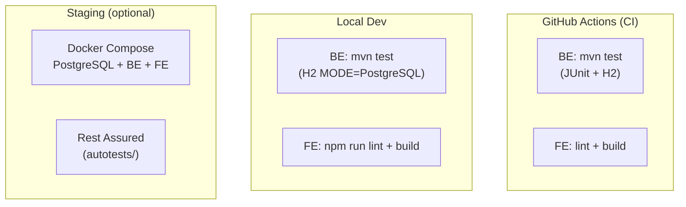
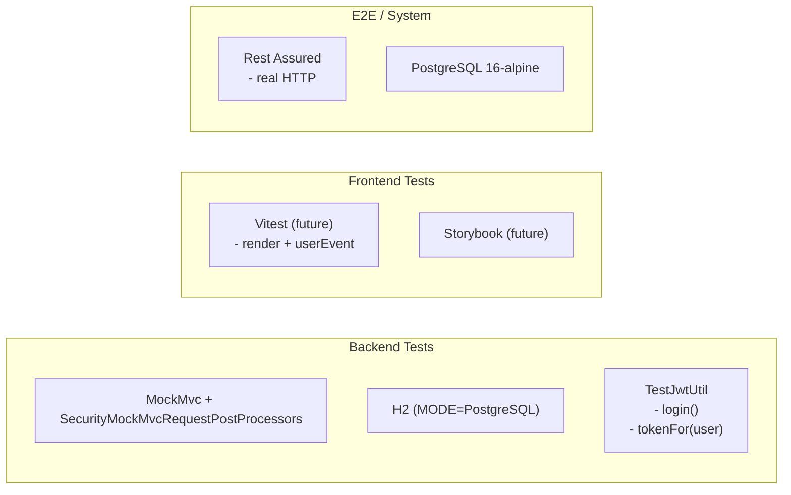

# System-Level Test Architecture

## 1. Test Overview

### 1.1 Цель документа

Определить архитектуру тестирования для фичи «Назначение исполнителя (assignee) и создателя (creator) на карточку» на system-level. Документ описывает уровни тестирования, среду, инструменты, стратегию данных, автоматизацию и интеграцию с CI. Результаты этого документа — foundation для последующей декомпозиции на epics и stories.

### 1.2 Scope

| Входит | Не входит |
|--------|-----------|
| Тестирование Backend: Card entity (creator/assignee), CardService, BoardService (доступ), UserController | Создание пользователей (POST /api/users) — precondition, требует отдельной задачи |
| Тестирование Frontend: Avatar, CardForm (dropdown assignee), BoardPage (роль), Card (отображение) | Уведомления о назначении (deferred) |
| Тестирование миграции Flyway V3 + бэкфилл | Кэширование прав доступа (deferred) |
| Регрессионное тестирование существующих FR-1..FR-15 | E2E-тесты на CI — не разворачиваются автоматически |
| NFR: приватность, атомарность, идемпотентность, производительность EXISTS | Event-модель, интеграции (нет в фиче) |
| Security-тестирование: ролевая модель, утечка данных | Load/stress тестирование (MVP) |
| Безопасность FE: условный рендеринг для ролей | |

### 1.3 Risk-Based Testing Approach (Murat — TEA Master)

Фича вводит фундаментальное изменение: переход от single-user к multi-user-aware системе. Assessed risks:

| Risk ID | Описание | Severity | Priority |
|---------|----------|----------|----------|
| R-TA-1 | Нарушение access control: assignee получает доступ к мутациям (создание/редактирование/удаление) | Critical | P0 |
| R-TA-2 | Утечка данных: assignee видит чужие доски/карточки | Critical | P0 |
| R-TA-3 | NOT NULL creator_id: поломка существующих тестов и миграции | High | P0 |
| R-TA-4 | Атомарность: assignee получает доступ к board, но карточка не создаётся | High | P1 |
| R-TA-5 | Снятие assignee: доступ теряется некорректно (EXISTS race condition) | Medium | P1 |
| R-TA-6 | FE: assignee видит UI мутаций (кнопки create/edit/delete) | High | P0 |
| R-TA-7 | FE: optimistic move + assignee — рассинхронизация состояния | Medium | P1 |
| R-TA-8 | Идемпотентность повторного назначения assignee | Low | P2 |
| R-TA-9 | Производительность EXISTS-подзапроса при 1000+ карточек | Low | P2 (deferred) |

---

## 2. Test Levels and Strategy

### 2.1 Unit Tests (Backend)

**Scope:** Логика сервисов, DTO mapping, валидация.

| Module | Что тестируем | Risk link |
|--------|--------------|-----------|
| `CardService.create()` | Установка creator из principal; опциональный assignee; выдача доступа | R-TA-1, R-TA-4 |
| `CardService.update()` | Смена assignee; null assignee (снятие); проверка EXISTS для сохранения доступа | R-TA-5 |
| `BoardService.canAccessBoard()` | author_id OR EXISTS assignee_id; чужие доски → false | R-TA-2 |
| `BoardService.getBoardsForUser()` | Список досок: авторские + по assignee | R-TA-2 |
| `UserController.getAllUsers()` | ADMIN 200; non-ADMIN 403; пустой список | R-TA-1 |
| DTO validation | CreateCardRequest/UpdateCardRequest — валидация assigneeId (null/valid/invalid) | — |
| Flyway V3 migration | Бэкфилл creator_id; SET NOT NULL; индексы | R-TA-3 |

**Tooling:** JUnit 5, AssertJ, Mockito (только если тестируем изолированно от Spring), @SpringBootTest для интеграционных проверок.

### 2.2 Integration Tests (Backend) — Primary Level

**Scope:** REST-контракты через MockMvc, in-process H2 (MODE=PostgreSQL), реальный JWT.

Этот уровень — основной для данной фичи, так как access control и атомарность требуют in-process проверки всего стека (Controller → Service → Repository → DB).

| Test Class | Тестирует | Risk |
|------------|-----------|------|
| `CardAssigneeIntegrationTest` | AC-1.1..1.3, AC-2.1..2.2 | R-TA-1, R-TA-4, R-TA-8 |
| `BoardAccessIntegrationTest` | AC-3.1..3.3, EC-2, EC-4 | R-TA-2, R-TA-5 |
| `UserControllerIntegrationTest` | AC-4.1, CT-8 | R-TA-1 |
| `KanbanRegressionIntegrationTest` | RGR-4, CT-10 — существующие сценарии не сломаны | R-TA-3 |
| `CardMoveIntegrationTest` | CT-9 — move не меняет assignee | — |

**Key test scenarios:**

```java
// Pattern для access control:
// 1. Создать board (ADMIN_A)
// 2. Создать card с assignee = USER_B
// 3. Залогиниться как USER_B
// 4. GET /api/boards/{boardId} → 200 (доступ через assignee)
// 5. POST /api/cards (USER_B) → 403 (нет роли ADMIN)
// 6. GET /api/boards/user_B_not_assigned — 404
```

### 2.3 Frontend Component Tests

**Scope:** Рендеринг компонентов с разными props; условный рендеринг по роли.

| Component | Тестирует | Risk |
|-----------|-----------|------|
| `Avatar` | Рендеринг с username (инициалы); null assignee (placeholder); размеры small/medium | — |
| `Card` | Отображение creator username; assignee avatar/placeholder; все поля | — |
| `CardForm` | Dropdown assignee с данными из getUsers(); creator read-only | — |
| `BoardPage` | ADMIN видит мутации; assignee НЕ видит create/edit/delete | R-TA-6 |

**Note:** FE-тесты не выполняются автоматически на CI (gate = `npm run lint` + `npm run build`). Рекомендуется добавить Vitest-тесты для BoardPage адаптации роли, но это — отдельный epic (см. handoff).

### 2.4 E2E / System Tests (autotests/)

**Scope:** Полный сценарий через API (Rest Assured) против поднятого стенда.

| Suite | Сценарии |
|-------|----------|
| `AssigneeAccessE2E` | ADMIN создаёт карточку → assignee логинится → видит доску → не может мутировать |
| `RegressiveE2E` | Существующие дымовые сценарии не сломаны после миграции V3 |

**Deferred:** UI E2E (Selenide) — добавлять после стабилизации FE-эпиков.

---

## 3. Test Environment Architecture



| Environment | Database | Назначение |
|-------------|----------|------------|
| CI (unit/IT) | H2 MODE=PostgreSQL | Быстрая обратная связь, все PR |
| Local dev | H2 MODE=PostgreSQL | Разработка и отладка |
| Staging | PostgreSQL 16-alpine | E2E-тесты перед релизом |

### 3.1 Test Data Strategy

**Fixture requirements:**
- Минимум 2 пользователя: ADMIN (bootstrap) + второй пользователь (Worker)
- Существующие доски и карточки (тестовые фикстуры)
- Бэкфилл существующих карточек: creator_id = bootstrap admin

**Data categories:**

| Категория | Данные | Использование |
|-----------|--------|---------------|
| Core | 2 пользователя, 2 доски, карточки с assignee и без | Основные сценарии |
| Edge | Пустой пользователь; доска без карточек; 0 досок | Граничные сценарии |
| Regression | Только bootstrap admin (до фичи), 1 доска, 3 карточки | Проверка миграции V3 |

**Note:** precondition — существование минимум 2 пользователей. Без механизма `POST /api/users` или SQL-скрипта тестирование assignee-сценариев невозможно. Требуется отдельная задача или SQL-фикстура для тестовых данных.

---

## 4. Automation Architecture



**Key patterns:**

```java
// Шаблон для integration test с разными ролями
@SpringBootTest
@AutoConfigureMockMvc
@ActiveProfiles("test")
class CardAssigneeIntegrationTest {
    @Autowired private MockMvc mockMvc;
    
    private String adminToken;
    private String workerToken;
    private Long boardId;
    
    @BeforeEach
    void setUp() {
        // Создаём пользователей через репозиторий (не через API)
        // или используем @Sql("classpath:test-data/multi-user.sql")
        adminToken = loginAs("admin", "adminPass");
        workerToken = loginAs("worker", "workerPass");
        boardId = createBoard(adminToken);
    }
}
```

**Security context pattern:**
- `MockMvc` + `with(SecurityMockMvcRequestPostProcessors.jwt())` для прямого задания principal
- Для полноценного теста — реальный login → получение токена → использование в запросах

---

## 5. Test Data Migration Strategy

### 5.1 Flyway V3 Compatibility

| Concern | Решение |
|---------|---------|
| Существующие тестовые данные (`test/resources/data.sql`) | Добавить creator_id для всех карточек (bootstrap admin id) |
| H2 vs PostgreSQL синтаксис | H2 в MODE=PostgreSQL — Flyway V3 выполняет ALTER + UPDATE + SET NOT NULL |
| Бэкфилл в тестах | Перед тестами выполнить скрипт бэкфилла (или использовать @Sql) |

### 5.2 Test Fixture Plan

```sql
-- test/resources/test-data/multi-user.sql
INSERT INTO users (id, username, password_hash) VALUES 
    (100, 'test-admin', '$2a$10$...'),
    (101, 'test-worker', '$2a$10$...');
INSERT INTO user_roles (user_id, role_id) VALUES 
    (100, (SELECT id FROM roles WHERE name = 'ROLE_ADMIN'));

-- Существующие карточки получают creator_id
UPDATE cards SET creator_id = 100 WHERE creator_id IS NULL;
```

---

## 6. CI/CD Integration

| Gate | Что выполняется | Блокирует merge |
|------|----------------|-----------------|
| `mvn test` | Все unit + integration тесты | Да |
| `npm run lint` | Линтер FE | Да |
| `npm run build` | Сборка FE | Да |
| Sonar/Checkstyle | (если настроено) | Нет (recommended) |

**Recommended CI pipeline additions:**
1. Параллельный запуск backend IT (разделение на Auth/Board/Card suites)
2. `@Tag("slow")` для тестов миграции, исключить из быстрой обратной связи
3. Отдельный CI job для E2E (только на staging)

---

## 7. Risks and Mitigations (Test Architecture)

| Risk | Mitigation | Owner |
|------|------------|-------|
| H2 не поддерживает EXISTS корректно | Проверить MODE=PostgreSQL; если EXISTS падает — заменить на COUNT > 0 | BE Dev |
| Тестовые данные без creator_id → SQL Error | CI должен провалиться; фиксить в рамках реализации | BE Dev |
| FE не проверен на assignee-рендеринг | Gate = build; ручное тестирование перед релизом | QA / FE Dev |
| E2E стенд недоступен | Rest Assured можно гонять локально; CI без E2E | Dev |

---

## 8. Tooling and Framework Summary

| Уровень | Инструмент | Версия | Конфигурация |
|---------|-----------|--------|-------------|
| Backend UT | JUnit 5 + AssertJ | (Boot-managed) | `@SpringBootTest`, `@AutoConfigureMockMvc` |
| Backend IT | MockMvc | (Boot-managed) | H2 MODE=PostgreSQL, `@ActiveProfiles("test")` |
| FE Components | Vitest (future) | — | `render` + `@testing-library/react` + `userEvent` |
| E2E API | Rest Assured | (pom.xml) | `autotests/` |
| DB Test | H2 + Flyway | (Boot-managed) | `MODE=PostgreSQL;DB_CLOSE_DELAY=-1` |
| Test security | `spring-security-test` | (Boot-managed) | `SecurityMockMvcRequestPostProcessors` |

---

## 9. Contract Test Matrix (from Architecture Delta CT-1..CT-10)

| CT ID | Описание | Уровень | Risk | Статус |
|-------|----------|---------|------|--------|
| CT-1 | POST /api/cards без assigneeId — creator = current user, assignee = null | IT | R-TA-1 | Обязательно |
| CT-2 | POST /api/cards с assigneeId — creator + assignee + assignee получает доступ | IT | R-TA-1, R-TA-4 | Обязательно |
| CT-3 | POST /api/cards с несуществующим assigneeId — 404 | IT | R-TA-1 | Обязательно |
| CT-4 | PUT /api/cards/{id} с assigneeId: null — снятие назначения | IT | R-TA-5 | Обязательно |
| CT-5 | PUT /api/cards/{id} с новым assigneeId — смена + доступ новому | IT | R-TA-4 | Обязательно |
| CT-6 | GET /api/boards — assignee видит доски где есть его карточки | IT | R-TA-2 | Обязательно |
| CT-7 | GET /api/boards/{id} — assignee 200, чужой 404 | IT | R-TA-2 | Обязательно |
| CT-8 | GET /api/users — ADMIN 200, assignee 403 | IT | R-TA-1 | Обязательно |
| CT-9 | Move card — assignee не меняется | IT | — | Обязательно |
| CT-10 | Существующие тесты не сломаны (regression) | IT | R-TA-3 | CI gate |

---

## 10. Test Design Entry Points (для create-epics-and-stories)

На основе system-level анализа определены следующие точки входа для декомпозиции:

| Entry Point | Описание | Source |
|-------------|----------|--------|
| EP-1 | Backend: Card entity + repository + миграция V3 | architecture-delta §4.1, §4.5 |
| EP-2 | Backend: CardService — assignee/creator логика | architecture-delta §4.2, addendum §8 |
| EP-3 | Backend: BoardService — расширение доступа | architecture-delta §4.2, AD-5 |
| EP-4 | Backend: UserController — GET /api/users | architecture-delta §4.3 |
| EP-5 | Backend: Integration tests — CT-1..CT-10 | architecture-delta §5.3 |
| EP-6 | FE: Avatar component | architecture-delta §4.4 |
| EP-7 | FE: Card и CardForm — assignee field | architecture-delta §4.7, addendum §8 |
| EP-8 | FE: BoardPage — адаптация для роли assignee | architecture-delta §4.4 |
| EP-9 | FE: User API module + types | architecture-delta §4.7 |
| EP-10 | Precondition: создание дополнительных пользователей | addendum OQ-5 |
| EP-11 | Regression: обновление fixtures, существующие тесты | RGR-4, R-TA-3 |

---

## 11. Blocker and Dependency

**Blocker:** Отсутствует механизм создания пользователей (OQ-5 из addendum). Без минимум 2 пользователей тестирование assignee-сценариев (CT-1..CT-8) невозможно. Требуется реализация `POST /api/users` или предоставление SQL-фикстуры до или в рамках epics.
